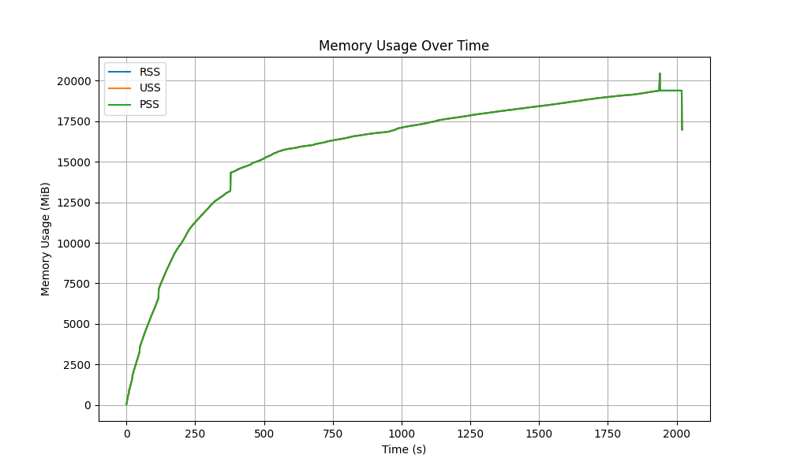
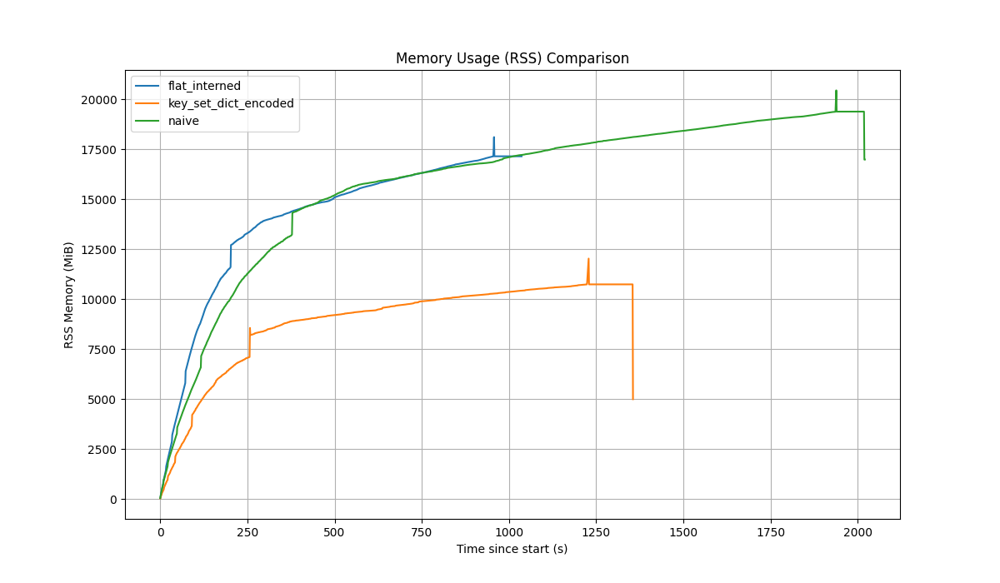

# LabelSetStore: from naive strings to dictionary encoding

When you ingest OTLP metrics, every datapoint carries a labelset (metric name plus label pairs).
The LabelSetStore is the hot path that maps a canonical labelset to a `SeriesRef` and deduplicates
the series. The storage layout you choose here determines both memory footprint and ingestion CPU.

Inspired by https://habr.com/ru/companies/flant/articles/878282/ (in Russian).

This article walks through three LabelSetStore implementations in Chronoxide:

1) `NaiveLabelSetStore` - intentionally inefficient, uses owned strings per series.
2) `FlatInternedLabelSetStore` - interns keys/values and stores label pairs in a flat arena.
3) `KeySetDictEncodedLabelSetStore` - groups by keyset and dictionary-encodes values.

`Data sources:

- `docs/experiments/labelset_store/results/bench_results.log`
- `docs/experiments/labelset_store/results/memory_results.log`
- `docs/experiments/labelset_store/results/naive.png`
- `docs/experiments/labelset_store/results/comparison_plot.png`
- `docs/experiments/labelset_store/results/time_results.md`
- `docs/experiments/labelset_store/results/key_set_dict_encoded.md`
- `docs/experiments/labelset_store/results/flat_interned.md`

## TL;DR

- Naive is easy to reason about, but it explodes memory and allocator pressure.
- FlatInterned is faster and far more memory efficient with almost no fragmentation.
- KeySetDictEncoded minimizes memory by sharing keys and dictionary-encoding values.
- **PackedKeySet** (sealed, read-only snapshot produced at report time) is the winner: **~69 bytes per series** (vs ~277 bytes for FlatInterned).

## Baseline: NaiveLabelSetStore

The naive store keeps each labelset as its own vector of owned strings:

```
Vec<Vec<OwnedKeyValue>>
OwnedKeyValue { key: String, value: String }
```

Each series allocates:

- a separate `Vec` header (ptr/len/cap),
- per-label heap allocations for `String` keys and values,
- and hash map bookkeeping for series lookup.

This is correct but hostile to memory: millions of small allocations amplify allocator overhead
and internal fragmentation.

### Memory blowup in practice

On a 400k-message ingest run, RSS rises to ~35 GiB in under a minute:



This uses the same capture as the 11M-message workload below; the chart shows the first ~400k messages.

This is not a pathological input. The naive layout stores owned strings per series, and its
`encode` path allocates `OwnedKeyValue` (new `String` key/value) before it can even check whether
the labelset already exists. That means every intern attempt allocates, even on cache hits, which
amplifies allocator churn and keeps RSS high.

### Criterion results

| Metric        |     Value |
|---------------|----------:|
| Intern unique | 15.042 ms |
| Visit 50k     | 331.69 us |

### Naive allocation profile (100k series)

TrackingAllocator output:

| Metric                 |       Value |
|------------------------|------------:|
| Alloc Calls            |   1,100,017 |
| Req Current            | 38,573,968B |
| Usable Current         | 55,782,208B |
| Internal Fragmentation |      30.85% |
| Estimate Used Bytes    | 37,200,128B |

## Why we need a better layout

Naive storage is correct but too expensive. We need to:

- avoid per-series `Vec` allocations,
- intern repeated strings instead of storing `String` for every series,
- and ideally reuse keysets to compress labelsets further.

## Improved: FlatInternedLabelSetStore

FlatInternedLabelSetStore fixes the two big problems:

1) It interns keys and values using `SymbolTable`, so repeated strings are stored once.
2) It stores all label pairs in a single flat `Vec<InternedKeyValue>`, with per-series
   offsets (`SeriesLoc`) pointing to slices inside the flat array.

This removes the per-series `Vec` and per-string heap allocations, and it preserves fast
labelset reads by slicing the flat array.

It is a drop-in performance win without changing query semantics. See the comparison section
for the numbers.

## Maximum compression: KeySetDictEncodedLabelSetStore

KeySetDictEncodedLabelSetStore takes the memory optimization further by separating keys from
values and dictionary-encoding values per key (global across keysets):

- A **keyset** is a sorted list of label keys (by symbol ID).
- For each key, we keep a **value dictionary** (global across keysets): `SymbolId -> ValueCode`.
- Each series row stores only `ValueCode` entries, one per key in the keyset.

This means:

- keys are stored once per keyset,
- values are stored once per key dictionary,
- series rows are dense arrays of compact codes.

It is highly effective when you have many series that share the same keyset and repeated values.
It produces the smallest memory footprint in the experiment.

To minimize memory further, this store supports a "sealed" state (`PackedKeySetLabelSetStore`) where the `ValueCode`
integers are bit-packed (e.g. into 1, 2, or 4-byte widths) based on the cardinality of each dictionary.

**This is the game changer.** As shown in the results, bit-packing reduces memory per series from ~185 bytes (unpacked)
to **~69 bytes** (packed).

### Visualization

To see how the "Keyset -> Dictionary -> Row" structure looks in practice, here is a dump of a small store with 3 series.

Notice how `namespace` and `pod` (which have higher cardinality) reuse values via codes `0` and `1`, while `__name__` is
stored just once in the keyset and has a single-entry dictionary.

```text
KeySetLabelSetStore
  series=3 keysets=1 value_dicts=5 sum_per_key_cardinality=7 symbols=12
  estimate_size_bytes=2300 estimate_used_bytes=1474
Symbols (first 200):
  SymbolId(0) "__name__"
  SymbolId(1) "pod_cpu_usage_seconds_total"
  SymbolId(2) "cluster"
  SymbolId(3) "prod"
  SymbolId(4) "container"
  SymbolId(5) "web"
  SymbolId(6) "namespace"
  SymbolId(7) "payments"
  SymbolId(8) "pod"
  SymbolId(9) "backend-123"
  SymbolId(10) "backend-1231"
  SymbolId(11) "payments2"
KeySets (first 200):
  KeySetId(0): [SymbolId(0)="__name__", SymbolId(2)="cluster", SymbolId(4)="container", SymbolId(6)="namespace", SymbolId(8)="pod"]
Value Dictionaries (first 200):
  Key SymbolId(0)="__name__": cardinality=1
    ValueCode(0) -> SymbolId(1) "pod_cpu_usage_seconds_total"
  ...
  Key SymbolId(6)="namespace": cardinality=2
    ValueCode(0) -> SymbolId(7) "payments"
    ValueCode(1) -> SymbolId(11) "payments2"
  Key SymbolId(8)="pod": cardinality=2
    ValueCode(0) -> SymbolId(9) "backend-123"
    ValueCode(1) -> SymbolId(10) "backend-1231"
Rows per KeySet (first 200):
  KeySetId(0): key_count=5 rows=3
    row 0: "__name__"="pod_cpu_usage_seconds_total", ... "pod"="backend-123"
    row 1: "__name__"="pod_cpu_usage_seconds_total", ... "pod"="backend-1231"
    row 2: "__name__"="pod_cpu_usage_seconds_total", ... "pod"="backend-1231"
Series (first 200):
  SeriesRef(0): KeySetId(0) row=0
  SeriesRef(1): KeySetId(0) row=1
  SeriesRef(2): KeySetId(0) row=2
```

The tradeoff is CPU on reads. To reconstruct a labelset from a `SeriesRef`, the store must:

1) **Fetch the Keyset**: Resolve `KeySetId` to the list of `SymbolId` keys.
2) **Fetch the Row**: Retrieve the `ValueCode` entries for this series.
3) **Resolve Values**: Fetch the per-key dictionary (hash lookup by key), then index into `code_to_value` to map each
   `ValueCode` to a `SymbolId`.
4) **Resolve Strings**: Finally, map the key/value `SymbolId`s back to strings via the SymbolTable.

This extra indirection (per-key hash lookup + code unpacking) explains why `visit_labelset` is ~8x slower than
FlatInterned in the benchmarks (2073us vs 258us).

## Benchmarking and allocator analysis

### Criterion results

| Store                          |     Intern unique (ms) | Visit 50k (us) |
|--------------------------------|-----------------------:|---------------:|
| NaiveLabelSetStore             |                 15.042 |         331.69 |
| FlatInternedLabelSetStore      |                 10.706 |         258.63 |
| KeySetDictEncodedLabelSetStore |                 17.561 |         2073.4 |
| PackedKeySetLabelSetStore      | can't intern, readonly |         2211.4 |

The `PackedKeySet` visit time (2211.4 us) is ~7% slower than the unpacked version (2073.4 us). This delta represents the pure CPU cost of bit-unpacking the values. However, both KeySet variants are significantly slower than FlatInterned (~258 us) due to the dictionary lookups. This confirms that while bit-packing adds a small CPU tax, the primary latency cost comes from the dictionary structure itself.

PackedKeySet numbers come from sealing the KeySet store at report time. This is a read-only snapshot, not an ingestion-time layout.

### Allocation and fragmentation (100k series)

TrackingAllocator output:

| Store                          | Alloc Calls | Req Current | Usable Current | Internal Frag | Estimate Used Bytes |
|--------------------------------|------------:|------------:|---------------:|--------------:|--------------------:|
| NaiveLabelSetStore             |   1,100,017 | 38,573,968B |    55,782,208B |        30.85% |         37,200,128B |
| FlatInternedLabelSetStore      |     100,036 | 13,828,128B |    13,832,248B |         0.03% |         10,003,323B |
| KeySetDictEncodedLabelSetStore |     200,073 | 12,913,536B |    12,913,672B |         0.00% |          9,205,207B |

## Results on 11 million OTLP messages

### Workload summary

These results are from 11,376,766 OTLP messages captured over a ~3h30m window and replayed from
`/tmp` (RAM-backed) to minimize storage I/O:

| Metric                            |        Value |
|-----------------------------------|-------------:|
| Total Messages                    |   11,376,766 |
| Total OTLP Metric Records         |   81,825,901 |
| Total Unique Metrics (`__name__`) |       19,953 |
| Total Series (unique label sets)  |   79,005,309 |
| Total Datapoints                  |  413,593,326 |
| Overall Window                    | 03:29:57.479 |
| Sum per-key cardinality           |    3,101,759 |
| Global distinct values            |    2,620,274 |

Sum per-key cardinality is the sum of per-key dictionary sizes across all keys (values counted once per key).
Global distinct values is the number of unique values across all keys.

### RSS comparison across stores

RSS over time for FlatInterned and KeySetDictEncoded stores (same workload, same host):



### Latency on real workload

DP Intern is a per-message average time per datapoint spent in labelset interning.

| DP Intern         | Count    | Mean, us | StdDev, us | Min, ns | Max, ms | P50, us | P75, us | P95, us | P99, us |
|-------------------|----------|----------|------------|---------|---------|---------|---------|---------|---------|
| FlatInterned      | 11376766 | 1.154    | 35.843     | 180     | 106.377 | 1.164   | 1.343   | 1.74    | 2.337   |
| KeySetDictEncoded | 11376766 | 1.651    | 36.055     | 277     | 107.732 | 1.677   | 1.937   | 2.49    | 3.366   |

### `/usr/bin/time -pv`

End-of-run stats from `/usr/bin/time -pv` (pinned to CPU cores 10-16):

| Metric                                 | FlatInterned | KeySetDictEncoded |
|:---------------------------------------|:-------------|:------------------|
| User time (seconds)                    | 1045.78      | 1378.54           |
| System time (seconds)                  | 4.55         | 3.71              |
| Percent of CPU this job got            | 101%         | 101%              |
| Elapsed (wall clock) time              | 17:17.47     | 22:36.16          |
| Maximum resident set size (kbytes)     | 18928756     | 12366240          |
| Minor (reclaiming a frame) page faults | 5296890      | 3656262           |
| Voluntary context switches             | 178          | 755               |
| Involuntary context switches           | 19186        | 24622             |

### Store statistics

Store size from the Markdown reports:

| Metric                 |   FlatInterned | KeySetDictEncoded | PackedKeySet  |
|------------------------|---------------:|------------------:|---------------|
| Series Count           |     79,005,309 |        79,005,309 | 79,005,309    |
| Allocated Bytes        | 21,881,684,216 |    14,621,358,208 | 5,435,546,915 |
| Used Bytes             | 16,899,455,295 |     9,538,832,603 | 4,329,039,698 |
| Allocated Bytes/Series |         276.96 |            185.07 | 68.80         |
| Used Bytes/Series      |         213.90 |            120.74 | 54.79         |
| Symbols                |      2,621,843 |         2,621,843 | 2,621,843     |

The `PackedKeySet` column highlights the power of bit-packing. By shrinking the `ValueCode` integers (mostly to 1 or 2
bytes) and removing `Vec` overhead, we achieve **68.80 bytes per series**.

Compared to `FlatInterned` (~277 bytes/series), the packed store is **4x more memory efficient** for this workload.

## Summary

If you need a safe baseline, `NaiveLabelSetStore` is simple but too expensive for real workloads.

If you want a default that is fast and memory efficient, `FlatInternedLabelSetStore` is the
best balanced choice.

If you are chasing the lowest memory possible and can tolerate slower labelset reads,
`KeySetDictEncodedLabelSetStore` wins on memory by a large margin.

In practice:

- Use FlatInterned for ingestion + query hot paths.
- Use KeySetDictEncoded for memory-constrained scenarios or background compaction paths.

## Appendix: Bench Environment

- Ubuntu 25.10
- Kernel `6.17.0-8-generic`
- CPU: AMD Ryzen 9 9950X (16-core), x86_64
- Build flags: `-C target-cpu=native` (via `.cargo/config.toml`)
- Note: CPU frequency scaling/turbo can shift small deltas; keep clocks stable when comparing close results.

## Appendix: Detailed Latency Statistics

Metric definitions:

| Metric        | Meaning                                                                                  |
|---------------|------------------------------------------------------------------------------------------|
| Message Total | End-to-end time to process one OTLP message (decode + iterate + intern + build + stats). |
| DP Total      | Per-message average time per datapoint (Message Total / datapoints).                     |
| DP Intern     | Per-message average time per datapoint spent in labelset interning.                      |
| DP Build      | Per-message average time per datapoint spent building datapoint records.                 |

### FlatInterned

| Metric        | Count    | Mean     | StdDev    | Min   | Max          | P50     | P75      | P95       | P99        |
|---------------|----------|----------|-----------|-------|--------------|---------|----------|-----------|------------|
| Message Total | 11376766 | 57.128us | 269.053us | 290ns | 531.895066ms | 6.523us | 11.332us | 474.659us | 1.048633ms |
| DP Total      | 11376766 | 1.433us  | 35.845us  | 257ns | 106.379013ms | 1.439us | 1.657us  | 2.142us   | 2.9us      |
| DP Intern     | 11376766 | 1.154us  | 35.843us  | 180ns | 106.377411ms | 1.164us | 1.343us  | 1.741us   | 2.337us    |
| DP Build      | 11376766 | 279ns    | 130ns     | 52ns  | 56.639us     | 270ns   | 321ns    | 420ns     | 579ns      |

### KeySetDictEncoded

| Metric        | Count    | Mean     | StdDev    | Min   | Max          | P50     | P75      | P95       | P99        |
|---------------|----------|----------|-----------|-------|--------------|---------|----------|-----------|------------|
| Message Total | 11376766 | 77.866us | 327.766us | 410ns | 538.671167ms | 8.707us | 15.302us | 653.083us | 1.448757ms |
| DP Total      | 11376766 | 1.938us  | 36.058us  | 352ns | 107.734233ms | 1.952us | 2.258us  | 2.919us   | 3.961us    |
| DP Intern     | 11376766 | 1.651us  | 36.055us  | 277ns | 107.732661ms | 1.677us | 1.937us  | 2.49us    | 3.366us    |
| DP Build      | 11376766 | 286ns    | 196ns     | 52ns  | 107.05us     | 273ns   | 327ns    | 431ns     | 612ns      |
